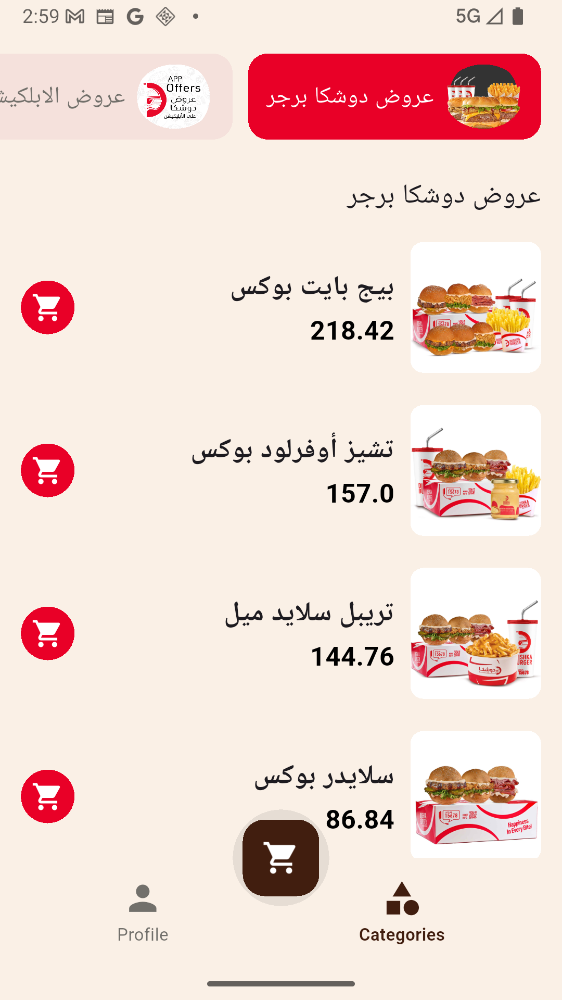
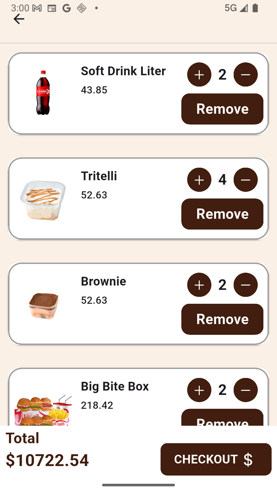
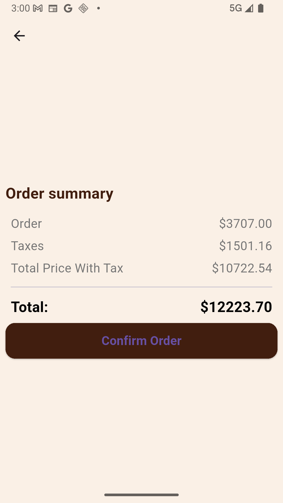
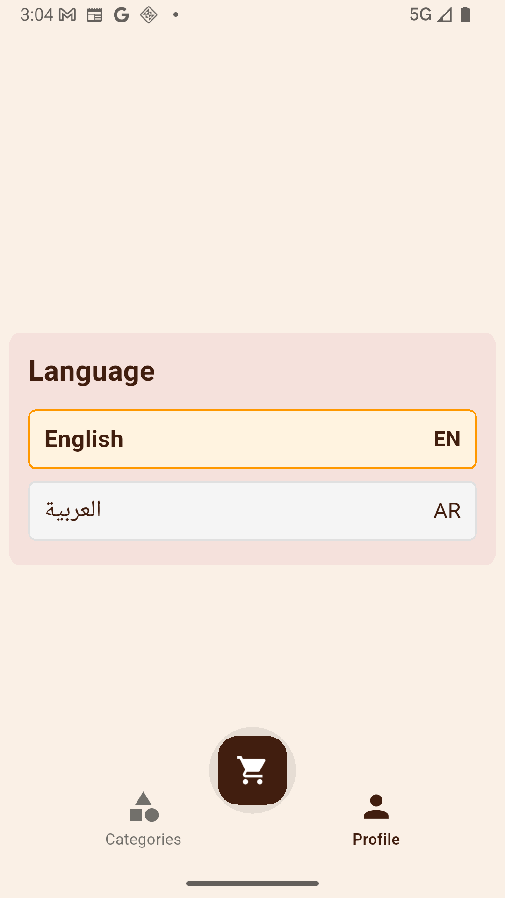

# Burger 🍔

🧭 NavigationBarScreen
A simple project that demonstrates a Navigation Bar with three main screens:
- 🛒 Cart: Displays the selected products.
- 👤 Profile: Change language.
- 📂 Categories: Lists different product categories

## 📦 Packages Used
- [`flutter_screenutil`](https://pub.dev/packages/flutter_screenutil)
- [`flutter_bloc`](https://pub.dev/packages/flutter_bloc)
- [`equatable`](https://pub.dev/packages/equatable)
- [`dio`](https://pub.dev/packages/dio)
- [`cached_network_image`](https://pub.dev/packages/cached_network_image)
- [`logger`](https://pub.dev/packages/logger)
- [`injectable`](https://pub.dev/packages/injectable)
- [`build_runner`](https://pub.dev/packages/build_runner)
- [`get_it`](https://pub.dev/packages/get_it)
- [`dartz`](https://pub.dev/packages/dartz)
- [`connectivity_plus`](https://pub.dev/packages/connectivity_plus)

## 📱 Screenshots

|                        Categories En                         |                Categories Ar                |                  Add Cart                   |
|:------------------------------------------------------------:|:-------------------------------------------:|:-------------------------------------------:|
|  |  |  |

|                 Get Cart                  |                Checkout                |                  Cart                   |                 Profile                 |
|:-----------------------------------------:|:--------------------------------------:|:-----------------------------------------:|:---------------------------------------:|
|  |  |  |  |

## 🎥 Demo Video

